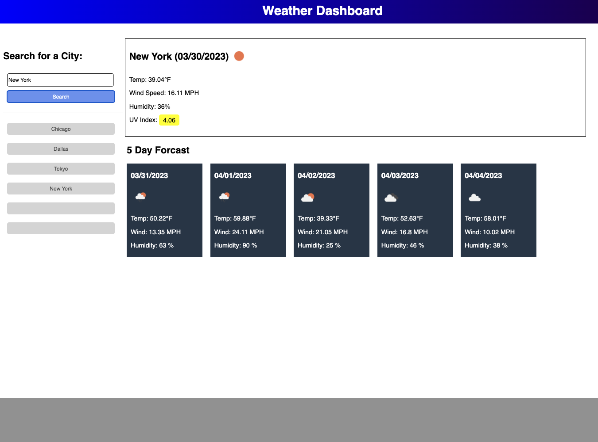

# Homework 6 - Weather Dashboard - Michael Mallon

## What I did
In homework 6, I used the OpenWeather Map API to retrieve weather related date for a given city. I also utalixed my knowlege in HTML and CSS development to write the front end for this application. The cities searched are saved in local storage and displayed on-screen in buttons. UV index is formatted based on how high it is. Weather pictures are retrieved based on the icon object that is retrieved when the API is given a city.

 

### Motivation:
I knew from the start that server-side APIs were important and this homework assignment was so-far the most interesting on for me. I am really excited for Project 1 where we will be using a server-side API of our choice. I know that this is good practice and will help me in the future

 

### Problems I solved:
    * Used moment() to display the current date
    * Used local storage to save and update an array
    * Manipulated array so elements in array are displayed as buttons
    * Used a server-side API to retrieve information about the weather
    * Manipulated API URL to get the information I wanted
 
 

## Installation:
Download all associated files in this repository including the index.html file and all files in the assets folder. Style sheet is located in ../assets/css/style.css, JavaScript is located in ../assets/js/script/js

## Usage:
The website has been deployed and can be accessed publicly by clicking [here](https://main.d36v7ke5sieg8n.amplifyapp.com/)

The website should look like this:

 

## Credits
- SMU
- [Mozilla](https://developer.mozilla.org)
- [HubSpot](https://blog.hubspot.com/website/css-border)
- [W3 Schools](https://www.w3schools.com/)
- [W3.org](https://www.w3.org/)
- [Stack Overflow](https://stackoverflow.com)
- [Moment](https://momentjs.com/)
